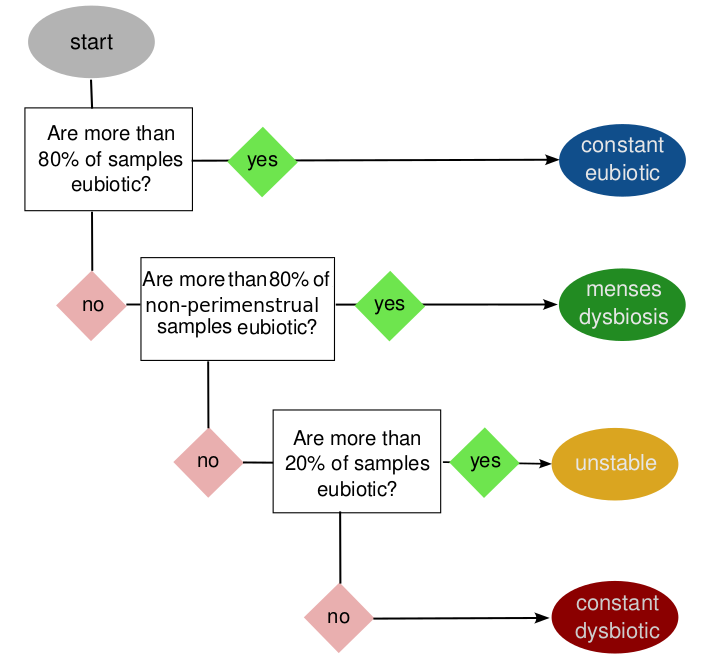

A tool to assign VAginaL DYnamic categories to individuals based on their
[VALENCIA](https://github.com/ravel-lab/VALENCIA) CST assignments.

# Citation
If using any part of this work, please cite "Hugerth LW, Krog MC et al, submitted"

# The theory
Vaginal microbiomes are tightly linked to the menstrual cycle, through
menstrual bleeding and/or changes to the mucosal lining associated with estrogen
levels. These microbiomes can also be affected by other factors, such as
intercourse, hygiene, medication and stochastic processes. VALODY is designed
to classify vaginal time-series according to the frequency and temporal pattern
of their [community state types](https://github.com/ravel-lab/VALENCIA) in
relation to subjects' menstrual cycles:

The user must therefore define:
* which CST are considered eubiotic (by default: I, II and V)
* Which days of the cycle are affected by menses. 

Empirically, we find that the last 2-3 days of the luteal phase should be
included in the "perimenstrual" period, so that in a 28 day cycle, days 1-8 as
well as 26-28 are considered perimenstrual and days 9-25 as "central". 

# In practice
The inputs to valody are the output of
[VALENCIA](https://github.com/ravel-lab/VALENCIA) as well as a comma-separated
file with the format

| sampleID | subjectID | menses |
|----------|-----------|--------|
| sample1  | subj1     | 1      |
| sample2  | subj1     | 1      |
|   ...    |  ...      | ...    |
| sampleN  | subjM     | 0      |

Where sample IDs should be identical to the ones in the VALENCIA output file
and menses should be marked as `1` for perimenstrual samples and `0` otherwise.

VALODY can then be run as:

    ./valody.py -i INPUT -m METADATA -o OUTPUT [-d DYSBIOSIS] [-e EUBIOSIS] [-s] 

    -i INPUT, --input INPUT, path to VALENCIA output
    -m METADATA, --metadata METADATA, CSV file with 'sampleID,subjectID,menses', where menses takes 1 for yes and 0 for no
    -o OUTPUT, --output OUTPUT, Output csv file 
    -d DYSBIOSIS, --dysbiosis DYSBIOSIS, comma-separated list of CST or sub-CST considered dysbiotic. Default: I, II, V
    -e EUBIOSIS, --eubiosis EUBIOSIS, comma-separated list of CST or sub-CST considered eubiotic. Default: III, IV
    -s, --subtypes, optional: use CST subtypes instead of main types; requires eubiosis and dysbiosis argument
